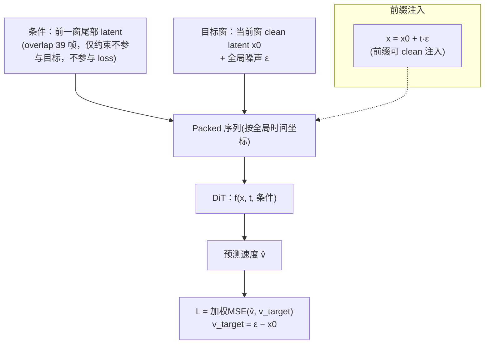
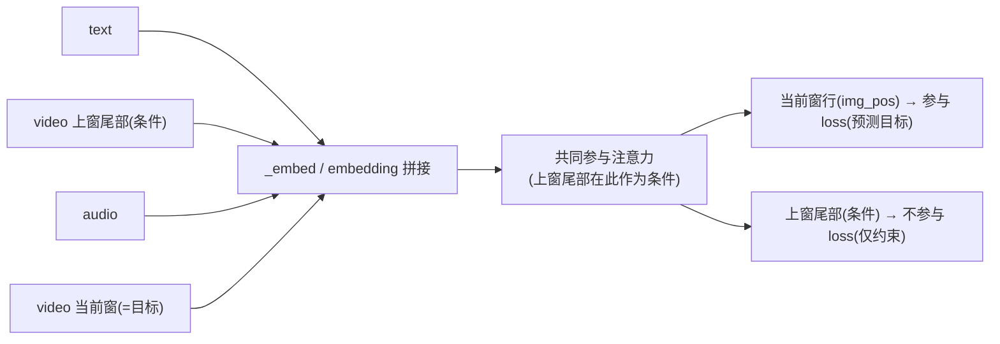
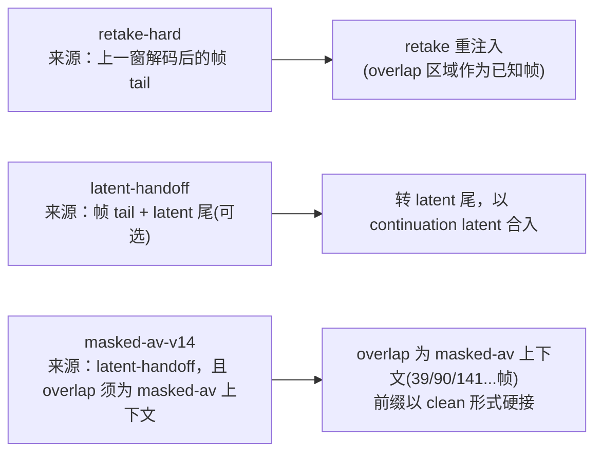
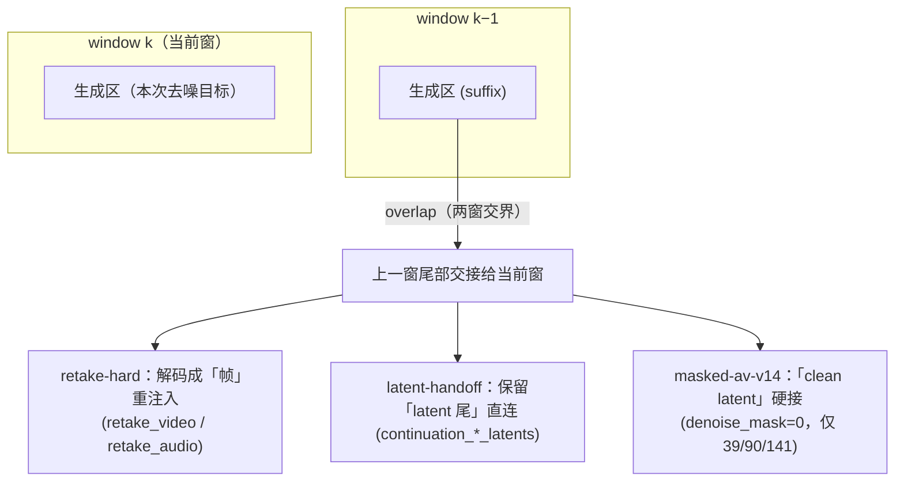
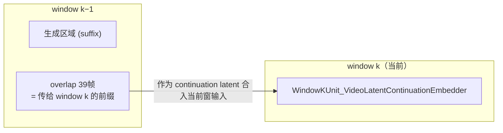
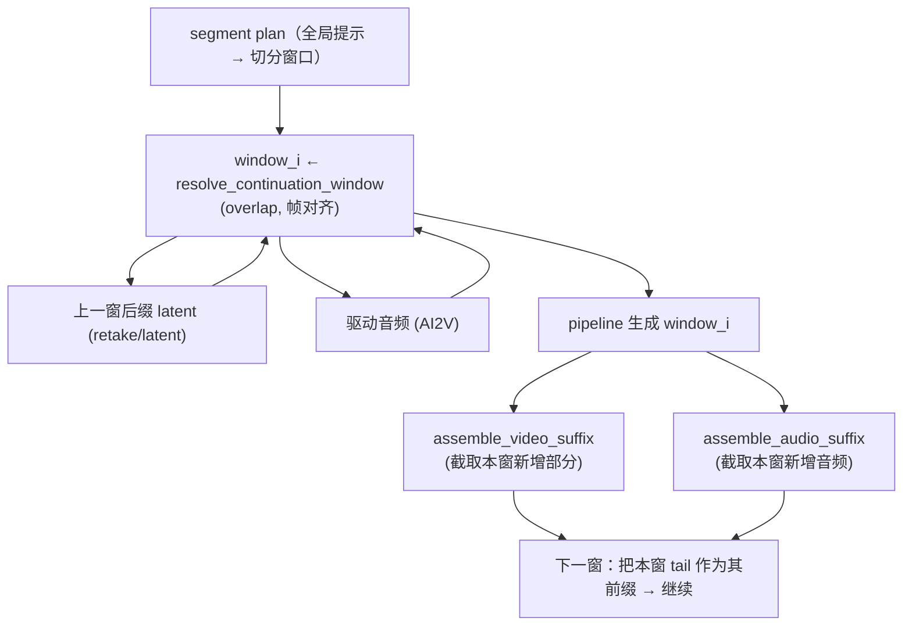
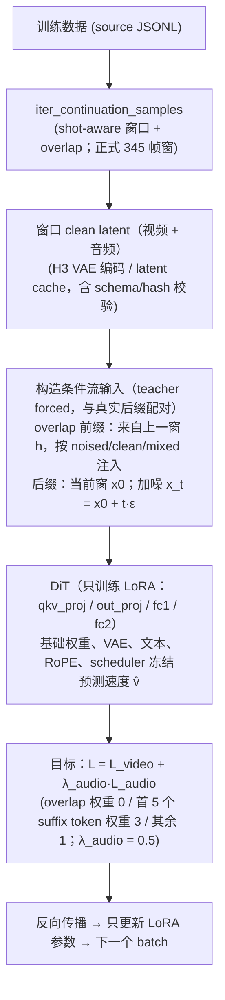
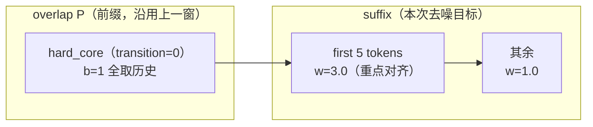

# MiniMax-H3 长视频接续生成原理与实现说明

> 这篇文章是**说明文档**，只介绍**抛开 memory 之外**的长视频接续生成机制——也就是
> masked-av-v14、retake-hard、latent-handoff 三种推理模式及其训练目标。先讲清楚解决什么问题、
> 三种模式各自怎么工作、核心原理与数学形式，再落到代码。不涉及与接续无关的基础设施
> （ZeRO-3 / DeepSpeed / LoRA 分块等）。记忆（memory）机制单独见 `minimax_h3_memory.md`。

---

## 0. 问题与总体思路

### 0.1 要解决的问题

单次生成的长度有限（受算力、显存、上下文长度约束）。生成长视频（如 60s）时，通常做法是把
长视频切成若干个**窗口（window）**分别生成，再把窗口接起来。但直接分窗生成的致命问题是每个
窗口都是「独立起跳」的，**内容、运动、节奏在窗口边界不连续**，也就是常见的「切镜/跳变」。

MiniMax-H3 的接续生成的思路是：**把每个窗口变成上面一个窗口的「续写」**，让第 k 个窗口以
第 k−1 个窗口的尾部为条件去生成，从而把「多窗独立生成」转变为「条件生成」。

### 0.2 总体数据流



### 0.3 核心设计约束：训练与推理的「分布一致」

接续生成能否成立，取决于一个隐式前提：**训练时模型看到的前缀注入方式，要和推理时完全一致**。

- 推理（masked-av-v14）里，上一窗的尾部 latent 是以 **clean（无噪，timestep=1）** 形式注入的；
- 如果训练时把前缀按当前时间步 t 加噪后再注入，模型会把「干净注入」当成陌生分布，接续效果就差。

因此训练侧专门设计了 `prefix_present_mode: noised / clean / mixed` 来对齐二者的分布。这一思想是
整个第三节（训练层面）的核心动机，详见 3.7。

---

## 一、模型层面：DiT 如何组织"条件 + 当前窗"

### 1.1 输入在 latent 维上是压缩的

H3 的视频 latent 不是逐帧的，而是**一个 17 帧 clip 压缩成 5 个 latent token**（外加头尾 2 个
端点 token）。帧数必须满足：

```
帧数 = 17·n + 5        （如 39, 124, 345, 362 ...）
视频 latent token 数 = 5·((帧数−5)/17) + 2
```

由此得到常用换算：**39 帧 overlap → 12 个视频 latent token**；音频 latent rate = 40 步/秒。

这个「latent token 数」是把视频/音频/文本条件拼进一条 packed 序列、以及计算损失区域权重时
共同的时间轴单位。

### 1.2 条件与预测目标分离

接续生成中，模型的输入被分成「条件」与「预测目标」两部分。与 memory 无关，接续的核心条件是
**上一窗的尾部 latent**（以及全局文本、音频），它们约束当前窗，但不被要求去预测。


## 二、推理层面：多窗口在 inference 如何接续

### 2.1 三种接续模式：masked-av-v14 / retake-hard / latent-handoff

用户可选的实时接续模式有三种，它们解决同一个问题——**上一窗的内容如何成为当前窗的条件**——
但**条件的来源与注入形式**不同：



三者之间的关系——从**窗口**的视角看，关键只在 overlap 交界处怎么交接（上一窗尾部 → 当前窗头部）：



**从「上一窗尾部发生了什么」看三者的本质差异**

三者的差别集中在 **overlap 交界处**：上一窗生成完后，留下的是「**解码帧**」还是「**端到端的
latent**」；当前窗拿到后，是「**重编码**」还是「**直接续接**」。后缀 `j ≥ P` 的加噪规则三种
模式完全一致（`x_j = x₀ + t·ε`），所以公式上看不出区别——差别全在**前缀来源**。

用伪代码把三种模式的真实代码路径写出来（视频为例，音频同构）：

```python
# ── window k−1 生成结束，三种模式的分歧从这里开始 ──────────────────
if mode == "retake-hard":
    # 走 MiniMaxH3Unit_VideoRetakeEmbedder
    state.tail    = decode_to_frames(raw_output)      # [帧] 先解码
    body = encode_video(state.tail)                   # [latent] 再编码
    mask[0:P] = 0                                     # 前缀不重生成（region retake）
elif mode in ("latent-handoff", "masked-av-v14"):
    # 走 MiniMaxH3Unit_VideoLatentContinuationEmbedder
    state.tail    = raw_output.video_latents          # [latent] 端到端直接保留
    body  = state.tail                                # [latent] 不编解码
    mask[0:P] = 0                                     # 前缀不重生成
    # latent-handoff 可用任意 overlap；
    # masked-av-v14 额外要求 overlap 是联合 AV head（39/90/141…，见下）

# ── window k 去噪 ──────────────────────────────────────────────
input_latents[:, :, 0:P] = body[:, :, 0:P]           # 用上一窗物体盖住前缀
input_latents[:, :, P:]  = x0[P:] + t·ε               # 后缀照常加噪
```

两种实现路径的区别：

- **retake-hard**：tail 是**解码帧**，当前窗须经 VAE **重编码**再盖前缀（多一次有损往返）。
- **latent-handoff**：tail 是上一窗**端到端 latent**，当前窗直接盖前缀、**不调 VAE**。
- **masked-av-v14**：推理代码与 latent-handoff **完全相同**，只是额外要求 overlap 为联合 AV 头
  （39/90/141…）并与训练目标对齐。

### 2.2 latent 续接：把上一窗「交给」下一窗

推理的核心是 `MiniMaxH3Pipeline` 新增的 latent continuation 输入
（`continuation_video_latents` / `continuation_audio_latents`）。



原理：当前窗去噪开始时，它不是从纯噪声起步，而是**已经带上了上一窗真实生成的 tail latent**。
去噪器在这些已知帧的约束下续出本窗余下内容，边界因此平滑。这就是 masked-av-v14 的**条件主链路**：
上一窗尾部以干净 latent 形式注入当前窗开头。

注意 continuation 与同模态 retake 是**互斥**的（代码里 `continuation_video_latents` 与
`retake_video` 不能同时给出），二者都往里放「已知 latent」，但语义不同：retake 是局部重拍，
continuation 是接续整窗。

### 2.3 驱动音频（AI2V）

除「接上一窗」外，还支持音频驱动视频（AI2V）：`ai2v_audio` 在去噪期间保持**干净**（不随
时间步加噪），作为视频生成的音频侧条件。相当于音频为视频提供节奏/发声锚点，视频围绕它生成。

实际运行中 AI2V 与 masked 接续是**组合使用**的（见 `MiniMax-H3-AI2V-Masked-1min.py`）：

- 第一个窗口：用一张图像 keyframe + 整段驱动音频启动；
- 之后每个窗口：以上一窗的**干净 video latent 尾（39 帧 hard 前缀）**作为接续条件，再叠加下一段
  AI2V 音频条件；
- 所有窗口都先在 latent 空间生成、最后统一解码一次。

### 2.4 全局时间位置

多窗口不是孤立生成的，它们属于同一条全局时间轴。为此管线新增
`global_temporal_position_origin` / `global_video_latent_length` / `global_audio_latent_length`
等参数：每个窗口记录自己在**全局 latent 时间线上的起点与长度**，打包序列时按全局坐标分配位置
编码，从而避免各窗口各自从 0 起算导致的时间错位，保证生成位置一致、可拼接。

### 2.5 多窗口 Runner：把整条长视频接起来

`diffsynth/pipelines/minimax_h3_continuation.py` 的 `H3ContinuationRunner` 把上面的机制串成
「逐窗推进」的完整流程：



- 每个窗口都要做 **17n+5 帧对齐**（`resolve_h3_video_frames`），保证跨窗 latent 单位一致；
- `ContinuationState` 状态机记录已推进到第几个窗口，支持**断点续跑**；`H3ContinuationStateManifest`
  导出运行状态便于复现；
- 窗口生成完后用 `validate_continuation_joins` 做衔接自检（相邻窗边界差异度量）。

## 三、训练层面：数据如何构造、策略与目标

### 3.1 训练数据如何构造

训练数据从长视频源标注（JSONL）出发，经过「序列索引 → shot-aware 窗口切分 → latent 缓存」
三步得到，全程不把整段视频载入内存。

**第 1 步：序列索引（只读元数据）**

源 JSONL 每行是一条视频/片段记录，关键字段：

| 字段 | 用途 |
|---|---|
| `sequence_id` | 序列级 train/val/test 划分依据，禁止跨 split 泄漏 |
| `file_path` / `audio_path` | 源视频 / 音频路径（音频缺失显式标记） |
| `prompt` | 同时承载 shot 边界与 prompt / ASR / caption 清洗候选 |
| `[Shot N \| start-end]` | 被解析为可用 shot 区间 |

索引器逐行流式读取（`iter_continuation_samples` 等），**只有完整窗口落在同一 shot 内**才生成
正样本；出现跨 cut（`--- cut: frame_gap=... ---`）、未知 shot 边界、窗口跨 shot 时记录为拒绝
原因，不构造正样本。

**第 2 步：shot-aware 窗口切分**

- 窗口帧数必须满足 H3 的对齐条件 `17n+5`；常用档位：`124`（CPU/config smoke）、`243`
  （低成本调试）、`345`（正式训练与验证，14.375 s）。
- 每个窗口与它的接续重叠为 `overlap` 帧；默认训练 overlap 为 **39 帧 → 12 个视频 latent
  token**（约 65 个音频 latent step）。
- 视频统一到 24 fps，音频统一到 32 kHz，audio latent rate 固定 40 steps/s；视频/音频的帧、
  sample、latent 边界都由**同一物理时间区间**导出，避免相邻窗口累积漂移。

**第 3 步：latent 缓存**

`build_continuation_cache.py` 用 H3 Video / Audio VAE 把窗口编码成 latent，并写入缓存目录：

```text
<cache_dir>/<split>/<sample_id>.pt
<cache_dir>/<split>/manifest.jsonl
```

每条 cache 记录 schema version、shape、dtype、fps、sample rate、shot 区间、源文件 hash 与
窗口坐标；训练读取前会校验 schema / hash / shape / dtype / 采样率，不匹配则拒绝训练并提示重建
缓存，而不是静默回退。

### 3.2 训练策略总览

训练过程可以用下面这张图概括——每一步把「上一窗条件 + 当前窗后缀」喂进被冻结的 DiT（只训
LoRA），并按区域加权 / 分模态的目标回传：



- **任务入口**：`examples/minimax_h3/model_training/train.py` 的 `continuation_sft`，损失函数为
  `ContinuationFlowMatchSFTMiniMaxH3AudioVideoLoss`。
- **只训练 LoRA，冻结其余**：LoRA 默认注入 `attn.qkv_proj`、`attn.out_proj`、`mlp.fc1`、
  `mlp.fc2`；DiT 基础权重、VAE、文本编码器、RoPE、scheduler 全部冻结。训练目标是学一个小而
  专注的 adapter，让模型学会「以上一窗为条件续写」，而不是改动基础生成能力。
- **条件形态锁定 masked-av-v14**：`ContinuationRegionConfig.conditioning_mode="masked-av-v14"`，
  要求 `hard_core == overlap`、`transition == 0`，前缀整段硬保护（见 3.6）。这与推理主链路
  一致。
- **区域加权 + 分模态**：overlap 区域 loss 权重为 0（只保护不参与 loss 直接比较），首 5 个
  后缀 token 权重 3.0，其余 1.0；视频与音频各自归一化后以 `λ_audio=0.5` 合并（见 3.4 / 3.5）。
- **前缀呈现可配置**：`prefix_present_mode = noised / clean / mixed`，用于对齐训练与推理的前缀
  注入分布（见 3.7）。
- 训练技巧：支持 bf16、梯度检查点、CP 并行；每样本可携带自己的 overlap（优先读缓存元数据，
  未记录时回退运行级默认）。

### 3.3 接续目标 = 条件流匹配（flow matching）

H3 用 flow matching 生成：给定 clean latent `x₀` 与噪声 `ε`，中间状态为

```
x_t = (1−t)·x₀ + t·ε        t ∈ [0,1]
```

速度目标（即网络要预测的量）是

```
v = dx_t / dt = ε − x₀
```

接续训练新增的 `ContinuationFlowMatchSFTMiniMaxH3AudioVideoLoss` 就是在**同时给定前缀条件**
的前提下，让模型预测的速度逼近 true velocity。

### 3.4 区域加权损失

视频 latent 沿时间轴各 position 的重要性不同：**overlap（受保护的既知前缀）**与**刚接上的
前几个 token** 最需要对齐，因此按区域权重加权：

```
                 Σ_j  w_j · ‖ v̂_j − v_target,j ‖²
L_video  =  ─────────────────────────────────────────
                        Σ_j  w_j
```

其中 `j` 沿视频 latent token 轴求和，`w_j` 是 position 权重（「overlap 完全保护 / first suffix
高权重 / 其余 suffix 常规权重」）：

| 区域 | 权重 |
|---|---|
| hard core（overlap） | 0 |
| transition | 0.5 |
| 第一个完整 suffix video clip | 3.0 |
| 后续 suffix | 1.0 |

这是模型对**速度空间**的加权 MSE。

### 3.5 分模态联合损失

视频与音频是两条独立 latent，各自归一化后加权合并：

```
L_total = L_video + λ_audio · L_audio
```

默认 `λ_audio = 0.5`，即视频为主、音频辅助。视频和音频分别按有效 token 归一化后再组合，避免
音频 token 数量主导梯度。`weighted_flow_loss` / `continuation_flow_loss` 分别实现单模态加权损失
与合并。

### 3.6 v3 teacher forcing：前缀如何构造

这是接续训练的关键数学。设 overlap 前缀长度为 `P = hard_core + transition`，历史（上一窗）
前缀 clean 为 `h`，当前窗 clean 为 `x₀`，共享噪声为 `ε`：

```
main   部分： main_noisy     = x₀ + t·ε               （当前窗整体加噪）
history 部分： history_noisy = h + t·ε_prefix         （前缀用 ε 的前缀切片加噪）

输入融合（j ∈ [0, P)）：
     x_j = (1 − b_j) · main_noisy_j  +  b_j · history_noisy_j

目标融合（同区域）：
     v_j = (1 − b_j) · (ε − x₀)_j   +  b_j · (ε_prefix − h)_j
```

其中 `b_j` 是融合权重：**hard_core 区 b=1**（前缀完全来自历史，即「完全保护」）；transition 区
从 `transition_start_weight` 线性降到 `transition_end_weight`（可选）。



**masked-av-v14 特例**：`hard_core = overlap`，`transition = 0`，于是 `P` 段全部取历史
（`b=1`）。这也是代码里 `validate` 强制 `conditioning_mode=masked-av-v14` 时必须
`hard_core==overlap && transition==0` 的原因。

### 3.7 前缀呈现模式：noised / clean / mixed（对齐推理分布）

为什么需要这个开关？回顾 2.2 / 2.1（masked-av-v14）：**推理时前缀是 clean 注入的**（上一窗已是
生成完毕的干净 latent，且 `denoise_mask=0` 使模型把它当作 timestep=1）。而 3.6 的 v3 默认是把
前缀按 `t` 加噪注入
（`noised`）——二者分布不一致。

```
prefix_present_mode       前缀怎么放
──────────────────────────────────────────────────────────────
 noised     按当前 t 加噪注入（经典 v3，与目标风格一致）
 clean      直接放干净 latent，denoise_mask=0 ⇒ 模型视为 timestep=1
            （复现推理 masked-av-v14 的注入方式）
 mixed      每个微批 50/50 随机挑一种（且同一 CP 组内一致）
```

- `clean` 通过 `_clean_prefix_injection` 实现：把历史前缀行作为干净 latent 放入，其余行保持
  带噪（`denoise_mask=1`）；
- 目的：把「干净的既往内容」也纳入训练分布，让模型在推理时的 clean 前缀不再陌生；
- `mixed` 作为正则/鲁棒化，让模型同时见到两种形态。

---

## 涉及文件清单

| 文件 | 归属 | 说明 |
|---|---|---|
| `diffsynth/models/minimax_h3_dit.py` | 模型 | DiT 的「条件（上窗尾 / 文本 / 音频）/ 目标」embedding 组织 |
| `diffsynth/pipelines/minimax_h3_audio_video.py` | 推理 | latent continuation / AI2V / 全局时间位置能力 |
| `diffsynth/pipelines/minimax_h3_continuation.py` | 推理 | 多窗口接续 runner、latent 续接/解码/衔接评估 |
| `diffsynth/diffusion/loss.py` | 训练 | 接续流匹配损失、clean-prefix 注入 |
| `diffsynth/utils/continuation_lora.py` | 训练 | 损失子模块（v3/加权/合并）与窗口帧对齐工具 |
| `diffsynth/diffusion/runner.py` | 训练 | 接续 region 配置 |

公开测试入口：`tests/test_minimax_h3_continuation.py`、`tests/test_h3_continuation_lora.py`、
`tests/test_h3_continuation_lora_evaluation.py`。
